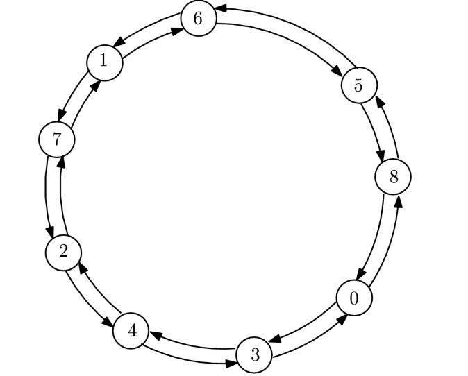
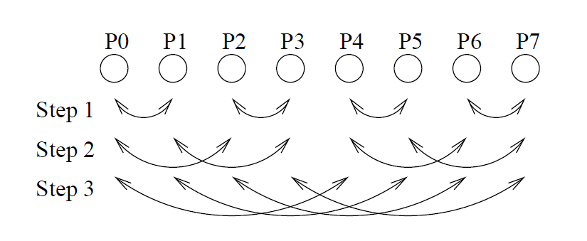
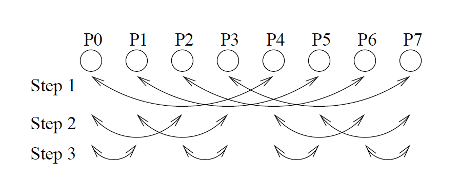

# Allgather

In this project we show algorithms used, in particular we will see from the theoretical point of view the structure of the same and analyze the methodology with which each of these algorithms performs the operation of Allgather.

## MPI_Send-MPI_Receive

This algorithm achieves the Allgather operation by using the MPI_Send and MPI_Receive operations. hrough a cycle each process sends, through a Send, its own portion of data to all the other processes; with a second cycle each process receives, thanks to a Receive, the data of each process (including itself).

## MPI_Gather-MPI_Bcast

This algorithm achieves the Allgather operation by using the MPI_Gather and MPI_Bcast operations. Through the collective operation of Gather, the master process receives the data from each process; then, through the collective operation of Broadcast, the master process sends the data previously received by Gather to all processes.

## MPI_Allgather

This algorithm performs the Allgather operation by using the native operation MPI_Allgather.

## Ring

This algorithm performs the Allgather operation by using the Send and Receive operations. By means of a loop you make the
rounds of the ring, where in the first round each process sends its own portion of data to the next process and receives from the previous process.



The master process receives from the last process and the last process sends to the master process. From the second round of the ring, each process sends the data received from the previous round. In this way, after n round, the Allgather operation is complete, where n is the number of processes.

## Recursive Doubling

This algorithm performs the Allgather operation by using the Send and Receive operations.



We divide the exchange between the processes into several steps, that is, in the first step will be created subtrees that will have processes that have a distance of 1. As a result, the processes within the same subtree will exchange their data. In the second step, it will be created subtrees whose processes have a distance of 2 which will exchange the data with processes that have distance 2. From the following steps will be created subtrees maintaining the same methodology, or distances equal to powers of 2. This will happen for n step, where n is the logarithm in base 2 of the number of processors.

## Recursive Halving

This algorithm performs the Allgather operation by using the Send and Receive operations.



We subdivide the exchange between the processes in various steps, that is, in the first step it will be created subtrees whose processes have a distance equal to 2(log2 𝑛𝑝)−1, where np is equal to the number of processes. As a result, processes within the same subtree will exchange their data. In the second step, subtrees will be created whose processes have a distance of 2(log2 𝑛𝑝)−2, which will exchange data with processes that have the same distance. From the following steps will be created subtrees maintaining the same methodology, that is distances equal to powers of 2. This will happen for n step, where n is the logarithm in base 2 of the number of processors.


## Allgather Algorithms

There are 6 different algorithms implementations of Allgather:

 • ex1:  An Allgather implementation by a simple MPI_Send/MPI_Receive

 • ex2:  An Allgather implementation by MPI_Gather/MPI_Bcast

 • ex3:  An Allgather implementation by MPI_Allgather

 • ex4:  An Allgather implementation by Ring Algorithm

 • ex5:  An Allgather implementation by Recursive Doubling Algorithm

 • ex6:  An Allgather implementation by Recursive Halving Algorithm

### Compile

```
mpicc <ex*.c> -lm -o <ex*>
```

### To run

```
mpirun -n nprocs --allow-run-as-root --oversubscribe ex* <data_size> <num_iterations> <delay_between_iterations>
```
