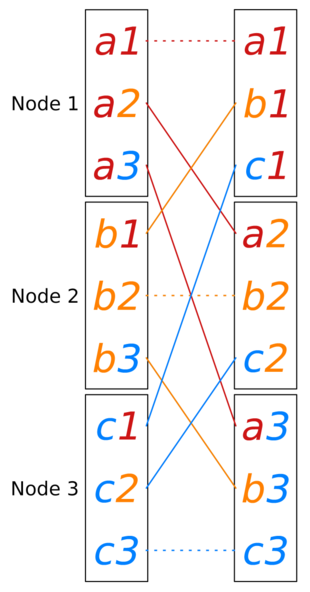

# AllToAll

In this project will be shown some algorithms that perform the operation of the All-to-all using the OpenMPI library. The algorithm were taken from scientific papers that have already dealt with the problem of optimization of the All-to-all communication. All-to-all is the most general communication pattern. For *0 <= i, j < p*, message *m(i,j)* is the message that is initially stored on node *i* and has to be delivered to node *j*.



## AllToAll Baseline

This is the baseline used to check the performance of the algorithms. It is the function **MPI_Alltoall** already existent in the OpenMPI library.

## AllToAll Datatype

This algorithm achieves the AllToAll operation by creating a custom type in MPI to send the information needed for each node in log(P) steps, where P is the number of processors. The type used is a MPI indexed block that is easier to manage insted of the circular one.

## AllToALL Index

This algorithm achieves the AllToAll operation using the naive Bruck Algorithm without any datatype. Basic Bruck has three steps, the second of which involves
communication.
- Local shift towards index 0 by *i* indices
- Global communication step with log2p rounds
- Local reverse and shift towards index *p − 1* by *i + 1* indices:

## AllToAll Radix r

This algorithm is divided in three phases.
- Each processor *p* independently rotates its *n* datablocks *i* steps upwards in a cyclical manner.
- Each processor *p* rotates its *jth* data block *j* steps to the right in a cyclical manner. This rotation is implemented by interprocessor communication.
- Each processor *p* independently rotates its *n* data blocks *i* steps downwards in a cyclical manner.

## AllToAll Zero copy

The previous implementations receive elements into an in termediate buffer which is then unpacked into the *recvbuf* before the next communication round. It would be desirable to eliminate this overhead. For instance, a received element which will have to be sent further on in a later communication round could remain in and be sent directly out of the intermediate buffer with no need for unpacking into the *recvbuf*. In general, elements for which the number of set bits *k' > k* in *j* is even will be received into *recvbuf*, and elements with an odd number of set bits *k' > k* will be received into the intermediate buffer.

### Compile

```
mpic++ <alltoall_*.cpp> -lm -o a.out
```

### To run

```
mpirun -n nprocs --allow-run-as-root --oversubscribe a.out <data_size> <num_iterations> <delay_between_iterations>
```
